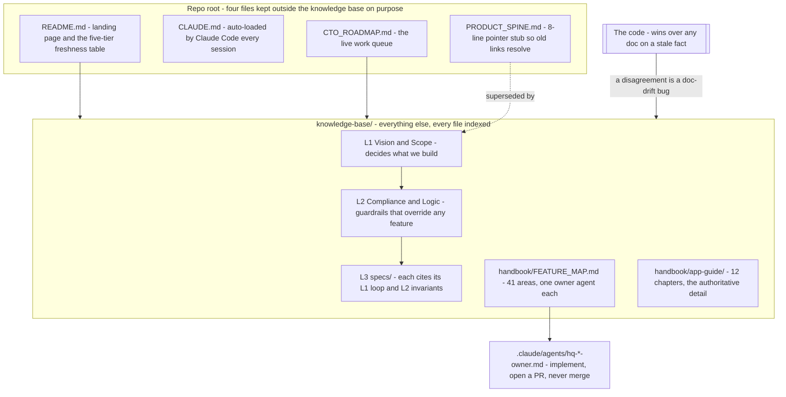

# 00 — Product, roles and the map

> **Freshness:** last verified 2026-08-23 · review every 30 days
> **Verified against** `origin/main` @ 6377727e · **Authoritative:** [app-guide 01 — Start Here](../handbook/app-guide/01-start-here.md) (it wins on conflict; the code wins over both; disagreements go to [LEDGER.md](LEDGER.md); counts are re-derived from [FACTS.md](FACTS.md)).

## The mental model

One Node process, one Postgres, one aggregate root (`loan_applications`), twelve roles where the
persona *is* the role, and a documentation ladder whose top rule is that the code outranks every
document.

## Explain it to a new hire

Homiquity is a licensed mortgage **brokerage** rendered as software: a borrower completes a
digital loan application (the industry form is called the URLA or "1003"), gets an instant,
deterministic pre-approval read, and their file becomes a standards-valid MISMO 3.4 package that we
deliver to a wholesale lender who actually funds the loan. Everyone who touches the system has one
of twelve roles declared in a single dependency-free file, `shared/roles.ts`: eight staff roles that
can only be provisioned by invite, two client roles (a renter "aspiring owner" and an "active
buyer"), and two partner roles (CPA, realtor) that are kept *out* of the staff list on purpose
because a public signup form creates them. There is no separate "persona" column — a borrower's
persona is their role, and the only promotion (`aspiring_owner` → `active_buyer`) happens in one
place, when they submit their first application. Documentation has two independent axes: a
*precedence* ladder (L1 vision decides scope, L2 compliance overrides any feature, L3 specs cite
both) and a *freshness* ladder (five tiers from live sources down to archive), and the tie-breaker
over both is written in the index: "code wins over any doc on a stale fact — that's a doc-drift bug
to fix". Everything you will work on is mapped in `knowledge-base/handbook/FEATURE_MAP.md` — 41
shipped feature areas, each with its key files and exactly one owner agent — and you will quickly
notice that the repository ships a second codebase alongside the TypeScript: Markdown that runs in
Claude (chapter 09).

## Mechanism



## The facts, with receipts

Every claim: `path:line` · the symbol there · the command that shows it (outputs at 12d7cbec).

- **The product is a brokerage, not a lender.** `README.md:3` — "An AI-native mortgage
  **brokerage** platform: borrower intake (digital 1003), document collection, deterministic
  underwriting, MISMO 3.4 packaging, and delivery of complete loan files to wholesale lenders."
  `sed -n '3,6p' README.md`.
- **The core loop is one sentence.** `knowledge-base/L1_VISION_AND_SCOPE.md:31` — "A borrower
  completes intake → gets an instant, deterministic pre-approval read → their file becomes a
  standards-valid MISMO package → we deliver it to a wholesale lender." `sed -n '31,32p' knowledge-base/L1_VISION_AND_SCOPE.md`.
- **Twelve roles in three groups, one file.** `shared/roles.ts:14` `STAFF_ROLES` (8: `admin, lo,
  loa, processor, underwriter, closer, broker, lender`); `:26` `CLIENT_ROLES` (2: `aspiring_owner`,
  `active_buyer`); `:36` `PARTNER_ROLES` (2: `cpa`, `realtor`); `:42` `ALL_ROLES` = 8 + 2 + 2.
  `grep -nE "^export const (STAFF_ROLES|CLIENT_ROLES|PARTNER_ROLES|INTERNAL_STAFF_ROLES|ALL_ROLES)" shared/roles.ts`.
- **The comment above `STAFF_ROLES` is a security rule.** `shared/roles.ts:10-13` — "Many
  endpoints gate on isStaffRole() alone, so a self-registerable role must never be added to this
  list (see PARTNER_ROLES)." `sed -n '10,13p' shared/roles.ts`.
- **Partners are excluded from staff *because of a public endpoint*.** `shared/roles.ts:31-35` —
  partner accounts are created by `POST /api/cpa-partners/register`, so treating them as staff
  "would expose every isStaffRole()-gated endpoint"; they are reachable only by exact-role checks.
- **Internal staff is staff minus the two external partners.** `shared/roles.ts:80`
  `INTERNAL_STAFF_ROLES` (6); the reason at `:77-79`: broker and lender "must be explicitly assigned
  to a deal-team before accessing any borrower record." (Chapter 02 shows the predicate that
  enforces it.)
- **Persona is the role.** `users.role` is a `varchar` defaulting to `aspiring_owner`
  (`shared/schema/core.ts:55`); there is no persona column. The single promotion site is
  `server/routes/lending/applications.ts:130-142` (`storage.updateUserRole(userId, "active_buyer")`,
  guarded to exactly `aspiring_owner`, audited). `grep -rn 'updateUserRole(' server --include='*.ts'`.
- **Four root docs, three living plus a stub.** `knowledge-base/README.md:5-8` names `CLAUDE.md`,
  `README.md`, `CTO_ROADMAP.md` as the three living docs outside the tree and `PRODUCT_SPINE.md` as
  the pointer stub; `wc -l PRODUCT_SPINE.md` → `8`.
- **Precedence and the tie-breaker.** `knowledge-base/README.md:14-15` — "Decisions flow **L1 → L2
  → L3**, and **code wins over any doc on a stale fact**." `sed -n '12,20p' knowledge-base/README.md`.
- **Freshness is a separate five-tier axis.** `README.md:55,65,81,85,101` — `### Tier 1 — Live
  sources of truth` … `### Tier 5 — Archive`. `grep -n '^### Tier' README.md`.
- **Machine authority is graded too, with different L-numbers.** `knowledge-base/routines/CHARTER.md:120`
  §6: L1 decides and acts · L2 acts then flags · L3 prepares, a human signs (merging any PR is a
  production deploy) · L4 human-only. Do not confuse doc-L1 (vision) with charter-L1 (autonomy).
- **The ownership map: 41 areas, 41 owners, one-to-one.** `knowledge-base/handbook/FEATURE_MAP.md:31`
  is the header row `| # | Area | Owner agent | Review domain | Last reviewed | Also writes here |`;
  `grep -cE '^\| [0-9]+ \| \[' knowledge-base/handbook/FEATURE_MAP.md` → `41`;
  `ls .claude/agents/hq-*-owner.md | wc -l` → `41`.
- **Owners implement but never merge.** `.claude/agents/_OWNER_RAILS.md:13` — "Never push to
  main, never merge, never enable auto-merge. Branch → PR → green gate → a human clicks. A merge to
  main is a production deploy."
- **The app-guide has 12 chapters.** `ls knowledge-base/handbook/app-guide/*.md | wc -l` → `12`.
  (The root `README.md:62` says "11-chapter" — LEDGER HO-0822-07.)
- **Stack versions.** `package.json:7` `"node": "24"` · `:87` `drizzle-orm ^0.45.2` · `:89`
  `:93` `express ^5.2.1` · `:106` `react ^19.2.8` · `:115` `zod ^4.4.3` · `:140` `tailwindcss ^4.3.3` ·
  `:144` `vite ^7.3.6` · `:145` `vitest ^4.1.10`. React 19 landed 2026-08-04 (`git log -S '"react": "^19' --format="%h %ad %s" --date=short -- package.json`
  → `39a42bfc 2026-08-04 …bump react… (#301)`), and the two app-guide chapters that still said
  React 18 were fixed by `3d047ce9` (#694) on 2026-08-23 (LEDGER HO-0822-06, closed).
- **Two package scripts are fuses, not commands.** `package.json:26` `db:generate` and `:29`
  `db:push` both begin `echo 'BLOCKED: …' && exit 1` — generate has snapshot drift; push drops
  columns owned by other branches on the shared dev DB, and prod is migrate-only (chapter 10).

## Prove it yourself

```bash
cd "$(git rev-parse --show-toplevel)" && git rev-parse --short HEAD   # any clean checkout of origin/main
# → 6377727e @ 6377727e
grep -cE '^export const (STAFF|CLIENT|PARTNER|INTERNAL_STAFF)_ROLES' shared/roles.ts
# → 4 @ 6377727e
grep -n 'export const ALL_ROLES' shared/roles.ts
# → 42:export const ALL_ROLES = [...STAFF_ROLES, ...CLIENT_ROLES, ...PARTNER_ROLES] as const; @ 6377727e
grep -n 'default("aspiring_owner")' shared/schema/core.ts
# → 55:  role: varchar("role", { length: 50 }).default("aspiring_owner").notNull(), // See ALL_ROLES constant @ 6377727e
grep -rn 'updateUserRole(' server --include='*.ts' | grep -v 'async updateUserRole' | wc -l
# → 4   (applications.ts promotion · admin.ts · staff-invites.ts redeem · auth.ts dev test-login) @ 6377727e
grep -cE '^\| [0-9]+ \| \[' knowledge-base/handbook/FEATURE_MAP.md ; ls .claude/agents/hq-*-owner.md | wc -l
# → 41 / 41 @ 6377727e
ls -1 knowledge-base/handbook/app-guide/*.md | wc -l
# → 12 @ 6377727e
grep -n '^### Tier' README.md
# → 55 / 65 / 81 / 85 / 101 — Tier 1 … Tier 5 @ 6377727e
grep -rn "React 18" knowledge-base/handbook/app-guide/ ; grep -n '"react":' package.json
# → (no hits — #694 fixed both chapters on 2026-08-23); package.json:106 "react": "^19.2.8" @ 6377727e
wc -l PRODUCT_SPINE.md
# → 8 @ 6377727e
```

## Where this breaks

| Trap | Where | Caught by |
|---|---|---|
| `isStaffRole()` includes `broker` and `lender`; `isInternalStaffRole()` does not. Using the wrong predicate on an object-level check hands an external partner every borrower record. | `shared/roles.ts:102` vs `:110`; rationale `:77-79` | Partially — `tests/adminPredicate.test.ts` guards only the `isAdmin` predicate; nothing greps a new call site for the wrong pair. Chapter 02 names the storage predicate to use instead. |
| Adding a self-registerable role to `STAFF_ROLES` opens every `isStaffRole()`-gated endpoint. | `shared/roles.ts:10-13`, `:31-35` | Nothing automated — the protection is the comment. |
| Two app-guide chapters said React 18 while the tree had shipped React 19 since 2026-08-04. **Resolved by #694, 2026-08-23** — but the class stands: no guard compares a prose version to the manifest (`guard:docs` checks dates, `guard:citations` checks paths). LEDGER HO-0822-06, closed. | `app-guide/01-start-here.md:22`, `app-guide/07-frontend.md:5` vs `package.json:106` | Nothing automated — the trap will recur on the next major bump. |
| The two indexes disagreed on the chapter count (root README said 11; KB README and disk said 12). **Resolved by #694, 2026-08-23** (LEDGER HO-0822-07, closed) — the class stands: `guard:kb` checks that files are indexed, not that counts are right. | `README.md:62` vs `knowledge-base/README.md:36` | Nothing automated. |
| `FEATURE_MAP.md` "Last reviewed" is a *domain* review date, not an area walk; 23 of 41 areas have never been reviewed. | `FEATURE_MAP.md:754-757`, `:769-771` | The file warns about itself; the record is `knowledge-base/routines/feature-coverage/LEDGER.md`. |
| Two rival taxonomies: 41 feature areas vs 13 review domains in `knowledge-base/feature-review/DOMAINS.md`. | `FEATURE_MAP.md:702-704` | Nothing — reconciliation is manual, by design ("when the two disagree, one of them is wrong"). |

## What we do not know

| Question | What resolves it |
|---|---|
| Is "11-chapter" in the root README stale, or an intentional exclusion of chapter 12? | The founder, or `git log -p -- README.md` around the commit that added `12-api-contract.md`. |
| Which owner agent owns `shared/roles.ts` as a *primary* file? Two agents merely mention it. | `grep -ln "shared/roles" .claude/agents/hq-*-owner.md` → admin-console and broker-portal; neither declares it. The founder decides. |
| Will `PARTNER_ROLES` stay at two? The `realtor` entry is tagged "PartnerHub PH-1". | The PH-1 row in `CTO_ROADMAP.md`. |

## Analogy

A hospital chart. The patient (the loan file) is one thing; the roles around it are strictly
scoped — the surgeon (underwriter) decides, the nurse (processor) prepares, and the referring GP
(a CPA or realtor partner) sees only that their referral is progressing and never opens the chart.
`INTERNAL_STAFF_ROLES` is the badge that opens the ward door; `PARTNER_ROLES` is a visitor pass.
The building's rulebook has a constitution (L1), statutes that override regulations (L2), and
regulations that cite both (L3) — and the running hospital itself is the case law that overrides
any of them when they have gone stale.

## Teach-back checkpoint

Answer each with a `path:line`; the key is in [TEACHBACK_KEY.md](TEACHBACK_KEY.md).

1. A PM proposes a borrower data-permission dashboard. What do you tell them, and where is the rule?
2. A `realtor` account reaches a staff-only endpoint. Name the two mistakes that could make that happen.
3. An external broker asks why they cannot see a borrower they are not assigned to. Bug or design?
4. `CTO_ROADMAP.md` and `L1_VISION_AND_SCOPE.md` disagree. Which wins, and on what question?
5. You need to change the pricing engine. Which agent do you invoke, and what will it refuse to do?
6. Why does `PRODUCT_SPINE.md` still exist if it is empty?
7. On 2026-08-22 the app-guide said React 18. What was actually true, and what does the repo's own rule say to do about a claim like that?
8. What is the one thing that decides whether you may write a file today — and is it ownership?

## Go deeper

- [app-guide 01 — Start Here](../handbook/app-guide/01-start-here.md) (with the React-18 caveat);
  `knowledge-base/L1_VISION_AND_SCOPE.md` §2 loop, §3 cut-line; `knowledge-base/L2_COMPLIANCE_AND_LOGIC.md`;
  the precedence block at `knowledge-base/README.md:12-20`; the tier tables at `README.md:36-104`.
- Ownership: `knowledge-base/handbook/FEATURE_MAP.md` (rows `:33-73`, detail `:83-695`);
  `.claude/agents/_OWNER_RAILS.md`; `knowledge-base/routines/feature-coverage/LEDGER.md`.
- Machine authority and the claim board: `knowledge-base/routines/CHARTER.md` §6 (`:246-274`),
  §5 (`:406`), §6 (`:507`); `knowledge-base/routines/REGISTER.md` — "a file in another session's
  open PR is claimed no matter who owns it; the claim outranks ownership" (`FEATURE_MAP.md:742-744`).
- Owner agents for this chapter's files: `shared/roles.ts` is referenced by
  `.claude/agents/hq-admin-console-owner.md` and `.claude/agents/hq-broker-portal-owner.md`; the auth
  surface is `.claude/agents/hq-auth-owner.md` (area 33, almost entirely hand-back).
