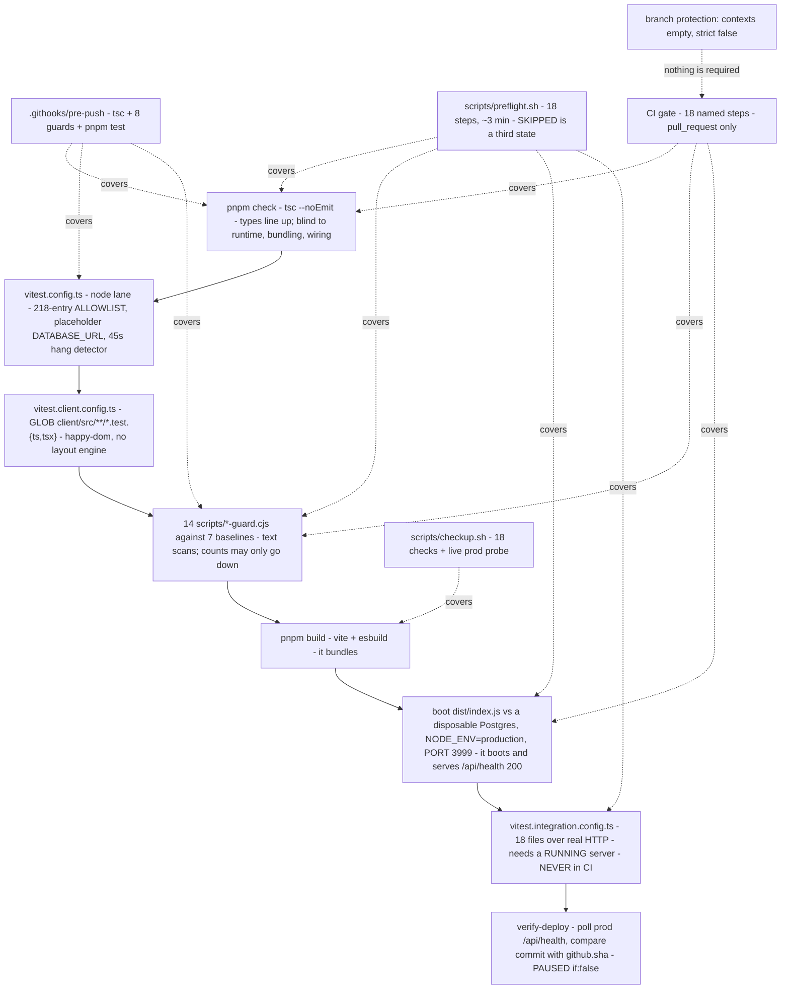

# 07 — Test harness and the CI proof hierarchy

> **Freshness:** last verified 2026-08-22 · review every 30 days
> **Verified against** `origin/main` @ 074899e3 · **Authoritative:** `../runbooks/CICD.md` §Checks, `../governance/TEAM_PRACTICES.md` §5 and `vitest.config.ts`'s own header (they win on conflict; the code wins over both).

> **Dated status box (re-verify on every refresh):** at 074899e3 `main` requires **no** status
> checks (`gh api …/branches/main/protection` → `contexts: []`, rulesets `0`); `migrate-prod` runs
> on dispatch only and `verify-deploy` is `if: false` (chapter 10); the test-collection guard that
> would catch a silently-shortened `pnpm test` is in an open PR, not on `main`; and one test file is
> stranded in neither vitest config (`tests/maintenanceMode.test.ts`).

## The mental model

Four independent proof lanes — `tsc`, the node allowlist, the client glob, the integration lane —
and only two and a half of them run anywhere automatically; the PR gate is the merge proof,
`preflight` is the ship proof, and `complianceInvariants` reads the source as text, so a failure
there is an incident, not a flake.

## Explain it to a new hire

`pnpm test` runs two vitest configs back to back: the **node** lane, whose `include` is a
hand-maintained allowlist of 218 entries in `vitest.config.ts` — an unlisted test file is silently
never run, and there is one stranded right now — and the **client** lane, whose `include` is a
glob on purpose so a colocated `*.test.tsx` "can never be silently stranded". A third config,
`vitest.integration.config.ts`, lists 18 files that hit a *running* HTTP server over the network
and never runs in CI at all — `CICD.md` says so explicitly, and `scripts/preflight.sh` is the only
thing that runs it. CI's one gate job is `gate (typecheck · tests · schema guard)` — those
separators are U+00B7 middle dots, matched byte-for-byte by branch protection — with 18 named
steps, fronted by a fail-closed "change scope" step that skips the expensive half when every
changed file is inert prose, and closed by a production build plus a boot of `dist/index.js`
against a disposable Postgres that must answer 200 from `/api/health`. Below CI sits
`.githooks/pre-push` (typecheck + eight guards + `pnpm test`, and it now *blocks* when `vitest` is
missing, since a PR once went up from a fresh worktree with zero checks), and above it
`scripts/preflight.sh` (18 steps including the build, the boot and the integration lane) and
`scripts/checkup.sh` (18 read-only checks plus a live prod probe). The caveat that outranks all of
it: branch protection on `main` currently requires nothing, so a green gate is advisory until it
is re-armed.

## Mechanism



## The facts, with receipts

- **The node lane.** `vitest.config.ts:30-300` `include: [ … ]` — `grep -cE '^\s*"tests/' vitest.config.ts`
  → `218`; `:25-26` `testTimeout: 45000`, `hookTimeout: 60000` ("TIMEOUTS ARE A HANG DETECTOR HERE,
  NOT A PERFORMANCE ASSERTION", `:8`; the suite runs 172 s idle and 305–419 s under load, `:11-12`);
  `:304-308` a placeholder `DATABASE_URL` keeps it hermetic; `:261-266` new entries are appended at
  the **END** ("#440 and #443 both went stale without merging because every concurrent PR inserted
  its entry just after `tests/accessControl.test.ts`… an unlisted test file is silently never run").
- **The client lane.** `vitest.client.config.ts:37` `include: ["client/src/**/*.test.{ts,tsx}"]`
  ("a GLOB on purpose", `:11-13`); `:18` `environment: "happy-dom"`; the `@assets` alias (`:47`)
  exists because without it a component test "reports '0 tests' rather than a failure" (`:44-46`).
  `git ls-files 'client/src/**/*.test.ts' 'client/src/**/*.test.tsx' | wc -l` → `120`.
- **The integration lane.** `vitest.integration.config.ts:15-34` — 18 files
  (`grep -cE '^\s*"tests/'` → `18`); `tests/setup.ts:1` `BASE_URL = TEST_BASE_URL || "http://localhost:5000"`;
  tighter timeouts than the unit lane (15 s / 30 s, `:13-14`). Every request sends
  `X-Forwarded-Proto: https` + `Origin` (`tests/roleSeparation.test.ts:31`), logs in through
  `POST /api/test-login` with a **per-file session cache of promises** because hammering the login
  route trips the auth limiter even under `RATE_LIMIT_RELAXED` (`:33-36`). Nine files define their
  own `loginAs`; 14 send the proto header. `knowledge-base/runbooks/CICD.md:353-357`: "The
  integration suite … never runs in CI: a green gate proves the change typechecks, breaks no unit or
  component test, and produces a bundle that boots and answers `/api/health` — nothing more."
- **Counts that must agree.** `git ls-files 'tests/*.test.ts' | wc -l` → `237`; 218 + 18 = 236
  configured; `comm -23 <(git ls-files 'tests/*.test.ts'|sort) <(grep -ohE '"tests/[^"]+\.test\.ts"' vitest.config.ts vitest.integration.config.ts|tr -d '"'|sort -u)`
  → `tests/maintenanceMode.test.ts` — stranded. The config itself records the precedent:
  `vitest.config.ts:140-141` — `changeOfCircumstance.test.ts` "Was in NEITHER config since it
  landed, so its 10 assertions had never run (same class as F-013's maintenanceMode.test.ts)".
- **Source-text tests.** `grep -lE 'readFileSync\(' tests/*.test.ts | wc -l` → `63` (27% of the
  node suite asserts on source text, not behaviour). `tests/complianceInvariants.test.ts` (691
  lines, 16 describes, 54 its): `:16` "If one of these fails, treat it as a compliance incident,
  not a flaky test"; the Reg B check is a grep of 8 decision-path modules for 6 AI import patterns
  (`:34-53`).
- **The harness helpers are thin by design.** `tests/setup.ts` exports `BASE_URL`, `apiGet`,
  `apiPost`, `apiPatch`, `apiDelete`, `fetchPage` — no app factory, no DB fixture, no shared login.
- **The gate job.** `.github/workflows/ci.yml:111` `name: gate (typecheck · tests · schema guard)`
  (`hexdump` shows `c2 b7` = U+00B7; rename procedure at `:101-110`); triggers `:47-94` —
  `pull_request` with **no `branches:` filter** (a filter once gave stacked PRs zero check-runs while
  reporting `CLEAN`, `:51-62`), `types: [opened, synchronize, reopened, edited, ready_for_review]`
  (`edited` because `guard:security` reads the PR body from the event payload, `:78-82`),
  `push: [main]`, `workflow_dispatch`. `if:` skips drafts and title-only edits (`:135-140`);
  concurrency cancels in-progress per PR and is safe only because of that `if:` (`:148-163`). The
  `postgres:16` service is for the boot probe only (`:166-169`).
- **The 18 gate steps, in order** (`grep -n '^      - name:' .github/workflows/ci.yml`): change
  scope (`:196`) → typecheck (`:254`) → unit tests (`:257`) → `pnpm audit --prod --audit-level=high`
  (`:260`) → `guard:schema` (`:268`) → `guard:migrations` (`:271`) → `guard:channel` (`:282`) →
  `guard:tokens` (`:292`) → `guard:ui` (`:303`) → `guard:kb` (`:316`) → `guard:staleness` (`:326`) →
  `guard:citations` (`:339`) → `guard:security` (`:351`, PR body via env, diff from the merge-base —
  two dots was F-0818-16, `:66-71`) → `guard:querykeys` (`:407`) → guard scripts parse (`:431` —
  added after a backtick inside `browser-probe.cjs` made every probe crash and a sweep read the
  stack trace as CLEAN, `:434-440`) → production build (`:449`) → `guard:bundle` (`:468`) →
  self-host boot (`:494`, `PORT=3999`, poll `/api/health` 45 × 1 s). Six doc-side steps run even on
  a docs-only PR (`:204-208`); the change-scope step fails closed (`:210-213`).
- **Pre-push.** `.githooks/pre-push` — `grep -c '^step ' .githooks/pre-push` → `10`: typecheck
  (`:102`), schema, ledger, delivery-stack, tokens, UI, kb-index, staleness, query-key (`:108-115`),
  `pnpm test` (`:117`). The tooling probe **blocks** when `node_modules/.bin/vitest` is missing
  (`:64-81`; reversed from warn-only on 2026-08-19 after "PR #608 went up from a fresh worktree with
  zero checks of any kind", `:57-62`). `grep -c PREPUSH .githooks/pre-push` → `0` — there is no
  opt-out variable on `main`. It names its own blind spots (`:129-133`): no build, no boot, no
  integration lane.
- **Preflight.** `scripts/preflight.sh` — `grep -c 'step "' scripts/preflight.sh` → `18` (its
  header says "sixteen"); stages `:79-188`: pre-push armed → tsc → the eight guards → guard-scripts
  parse → query-key → §9 security review (only when `origin/main` is fetched, else SKIPPED) → unit
  tests → `pnpm audit` → build → bundle ratchet → self-host boot (`BOOT_PORT 3999`) → integration
  lane (`INT_PORT 4000`, **dev mode on the production bundle** because `/api/test-login` 404s in
  production, `:177-181`). `--fast` skips build/bundle/boot/integration; `--no-db` skips the two DB
  stages; **SKIPPED is a third state that neither passes nor fails** (`:21`, `:63-65`, `:212-215`);
  every run prints what it cannot see (`:197-205`).
- **Checkup.** `scripts/checkup.sh` — `grep -c '^check "' scripts/checkup.sh` → `18`, including
  citations, regulatory-ledger freshness, living-doc freshness, and a live probe of
  `https://www.homiquity.com` (`:16`, the only lane that uses the `www` host); audits at
  `moderate` vs the gate's `high` (`:58` vs `ci.yml:267`); integration tests deliberately excluded
  (`:8-9`).
- **The guard fleet.** `ls scripts/*-guard.cjs | wc -l` → `14`; `ls scripts/*baseline*.json | wc -l`
  → `7`. Ratchets (down only; **auto-tighten on a shrink**): `bundle-size` (`:217-218`), `design-token`
  (`:116-119`), `citation`, `doc-staleness`, `schema-migration` (baseline allow-list), `ui-standard`,
  `delivery-stack-freeze` (may shrink, not grow). Hard pass/fail with no baseline: `kb-index`,
  `migration-ledger`, `query-key`, `query-key-transport`, `security-review`, `hooks-installed`.
  Calendar-based: `doc-freshness` (weekly workflow, deliberately outside the gate).
- **Gaps between the lanes.** Neither pre-push nor preflight runs `guard:citations`
  (`grep -n citation scripts/preflight.sh .githooks/pre-push` → nothing); both run **one** of the
  three query-key scripts (`pre-push:115`, `preflight.sh:93` call `query-key-guard.cjs` directly;
  `package.json:37` chains all three for CI). A citation regression or a dead invalidation passes
  locally and reds in CI.
- **What the meta-test pins.** `tests/ciTriggers.test.ts` (294 lines): `:110` migrate-prod wired
  for push+dispatch **or explicitly paused to dispatch only**; `:115` verify-deploy wired for push
  **or explicitly paused off**; `:120` no `pull_request` can reach a deploy job; `:135` drafts are
  skipped; `:153` verify-deploy probes the Railway origin, never `www`; `:191` migrate-prod is never
  cancellable; `:237` the scope step fails closed. It accepts the paused state by design.
- **Other workflows.** `cron-jobs.yml` (7 sweeps, pinned by `tests/cronSchedules.test.ts:30-40` —
  whose title at `:63` still says "six"), `doc-freshness.yml` (weekly, `0 9 * * 1`, deliberately not
  in the gate — "it would go red on the day ASSUMPTIONS.md hits day 31 and block EVERY merge",
  `:10-13`), `preview-seed.yml` (dispatch only).
- **The definition of done.** `knowledge-base/governance/TEAM_PRACTICES.md:93-135` — nine rules:
  `pnpm check` clean; `pnpm test` green in both lanes (new server tests added to the allowlist; UI
  behaviour gets a component test first); the integration suite green against a live worktree
  server on 5002 with `RATE_LIMIT_RELAXED=true`; live verification on the worktree port with
  evidence in the PR body; regulated math carries a ledger citation in the same commit; schema
  changes are hand-authored SQL; new env vars land in `.env.example` **and** CICD.md; the PR-body
  contract (verification evidence, dependency justification, prod-impact note, an explicit doc-sync
  line — "Silence is not a doc-sync statement"); state assumptions and the success criterion first.
  §8 (`:285-291`): "Grep before claiming 'missing'."
- **Ports.** Dev 5001 (from `.env.example`; code default 5000; AirPlay squats on 5000), worktree
  servers 5002+, preflight boot 3999 / integration 4000, CI boot 3999
  (`knowledge-base/runbooks/LOCAL_DEV.md:183-187`, `scripts/preflight.sh:37-38`, `ci.yml:510`).
- **The collection shortfall (not fixed on main).** An open PR documents that vitest 4 discovers
  files through tinyglobby → fdir with `suppressErrors: true`, so a `readdir` that fails under load
  is indistinguishable from an empty directory: in its reproduction one injected failure dropped 36
  of 118 files with "signal to the caller: NONE"; observed three times on 2026-08-20/21 (`Test Files
  111 passed (111)` when 118 existed). Until it lands, compare the reported `Test Files` counts
  with the on-disk counts yourself (the playbook's T1 sanity check).

## Prove it yourself

```bash
cd /Users/ammrebarakat/Developer/Homiquity-handoff && git rev-parse --short HEAD
# → 074899e3 @ 074899e3
grep -cE '^\s*"tests/' vitest.config.ts ; grep -cE '^\s*"tests/' vitest.integration.config.ts ; git ls-files 'tests/*.test.ts' | wc -l
# → 218 / 18 / 237 @ 074899e3
comm -23 <(git ls-files 'tests/*.test.ts'|sort) <(grep -ohE '"tests/[^"]+\.test\.ts"' vitest.config.ts vitest.integration.config.ts|tr -d '"'|sort -u)
# → tests/maintenanceMode.test.ts   (configured nowhere) @ 074899e3
git ls-files 'client/src/**/*.test.ts' 'client/src/**/*.test.tsx' | wc -l ; grep -n 'include:' vitest.client.config.ts
# → 120 / 37:  include: ["client/src/**/*.test.{ts,tsx}"], @ 074899e3
grep -lE 'readFileSync\(' tests/*.test.ts | wc -l ; grep -c '^describe(' tests/complianceInvariants.test.ts
# → 63 / 16 @ 074899e3
sed -n '111p' .github/workflows/ci.yml | hexdump -C | sed -n '2p'
# → … 6b 20 c2 b7 20 74 65 73 …   (c2 b7 = U+00B7 in the required-check name) @ 074899e3
sed -n '182,531p' .github/workflows/ci.yml | grep -c '^      - name:'
# → 18 @ 074899e3
grep -c '^step ' .githooks/pre-push ; grep -c PREPUSH .githooks/pre-push ; grep -c 'step "' scripts/preflight.sh ; grep -c '^check "' scripts/checkup.sh
# → 10 / 0 / 18 / 18 @ 074899e3
grep -n "citation" scripts/preflight.sh .githooks/pre-push | wc -l ; grep -n "query-key" .githooks/pre-push scripts/preflight.sh | grep -c "query-key-guard.cjs"
# → 0 / 2   (no citation guard locally; one of three query-key scripts) @ 074899e3
ls scripts/*-guard.cjs | wc -l ; ls scripts/*baseline*.json | wc -l
# → 14 / 7 @ 074899e3
gh api repos/barakatammre84/Homiquity/branches/main/protection --jq '{contexts: .required_status_checks.contexts, strict: .required_status_checks.strict}' ; gh api repos/barakatammre84/Homiquity/rules/branches/main --jq 'length'
# → {"contexts":[],"strict":false} / 0 @ 2026-08-22
sed -n '553p;621p' .github/workflows/ci.yml
# → if: github.event_name == 'workflow_dispatch' / if: false @ 074899e3
sed -n '63p' tests/cronSchedules.test.ts ; sed -n '/const SCHEDULES/,/^\];/p' tests/cronSchedules.test.ts | grep -c '^\s*\['
# → "schedules exactly these six sweeps…" / 7 @ 074899e3
```

## Where this breaks

| Trap | Where | Caught by |
|---|---|---|
| A new server test in neither config never runs — deliberate allowlist, no detector. Live example: `tests/maintenanceMode.test.ts`. | `vitest.config.ts:30-300`; `CICD.md:360-362` | Nothing diffs `git ls-files` against the two includes. Proposed ticket in chapter 12. |
| `pnpm test` can run fewer files than exist and exit 0 (fdir `suppressErrors`). | the open collection-guard PR; `package.json:15` | Nothing on `main`. |
| `main` requires zero checks; `enforce_admins: true` binds admins to an empty list. | `ci.yml:30-45` | No mechanism — the comment warns the previous version of itself said "✅ CONFIGURED" while false. LEDGER HO-0822-15. |
| `migrate-prod` paused → the journal runs ahead of prod; this already caused a 35-minute auth outage (migration 0057, `users.last_failed_login_at`). | `ci.yml:553`; the re-arm PR's body | `tests/ciTriggers.test.ts:110` *accepts* the paused state. |
| `verify-deploy` off → a failed Railway build leaves the previous container serving, all green. | `ci.yml:621` | `tests/ciTriggers.test.ts:115` accepts it; nothing polls the `commit` field. |
| `strict: false`: two individually green PRs can combine into a red `main`; the ratchets surface it on the *next* PR. | `ci.yml:296-301`; `CICD.md:339-343` | Detected late, by design. |
| The integration lane never runs in CI — all multi-role authorization coverage rides on someone running it. | `CICD.md:353-357` | TEAM_PRACTICES §5.3 asks for it in the PR body; preflight runs it only when a DB is available. |
| Two guards auto-write their baselines on a shrink; a preflight run can dirty the tree with a file you did not edit. | `design-token-guard.cjs:116-119`; `bundle-size-guard.cjs:217-218` | `checkup.sh:48` "working tree clean" — after the fact. |
| `guard:bundle` gates only the eager entry graph, raw bytes; a lazy route can never fail CI. | `bundle-size-guard.cjs:35-36,58-59` | By design. |
| `guard:ui` / `guard:tokens` are text scans — no layout engine; `unprefixedMultiColGrid` is a proxy for "breaks at 320 px". | `ci.yml:312-313`; `scripts/browser-probe.cjs:9-11` | Only `browser-probe.cjs`, which nothing runs automatically. |
| 63 of 237 node tests are source greps — "passes on wrong logic and breaks on renames" (F-014). | `hq-underwriting-owner.md:105` | Acknowledged, not caught. |
| Pre-push and preflight run a strict subset of the gate (no citations; 1 of 3 query-key scripts). | `pre-push:115`; `preflight.sh:93` vs `package.json:37` | CI — now that it runs again. |
| The pre-push probe blocks on `node_modules/.bin/vitest`; if the open hook PR lands the suite removal without the probe change, a checkout with `tsc` but no `vitest` blocks a push for a binary the hook no longer uses. | `.githooks/pre-push:67` | No test. |
| Stale counts inside the harness: `cronSchedules.test.ts:63` "six" (7); `pre-push:107` "9 guards" (8); `pre-push:133` and `preflight.sh:6` "sixteen" (18); `checkup.sh:2-9` lists 8 categories for 18 checks. | as cited | `doc-staleness-guard` scans `.md` vocabulary, not counts in scripts. LEDGER HO-0822-20. |

## What we do not know

| Question | What resolves it |
|---|---|
| Is the gate green on 074899e3? This chapter is about configuration and structure; nothing here ran the suites. | The playbook's tier dry-run (`pnpm check`, `pnpm test`, `pnpm preflight`), recorded with runtimes. |
| Would `tests/maintenanceMode.test.ts` pass if it were listed? | Append it to the allowlist in a worktree and run the node lane. |
| Do the open hook PR and the open collection-guard PR conflict? Both touch `.githooks/pre-push` and `package.json`. | `gh pr diff` on each. |
| Does `enforce_admins: true` with an empty context list have any effect at all? | The `ci.yml` comment asserts it does not; untested. |

## Analogy

An aircraft's pre-flight checklist with three gauges disconnected. `tsc` is "do the controls
move" — cheap, proves nothing about flight. The unit lanes are the ground run: the engine spins,
the instruments read, the aircraft never leaves the tarmac. The guards are the walk-around:
counting rivets against yesterday's count catches corrosion and cannot see a cracked spar. The
build-and-boot step is the taxi test — the thing moves under its own power. The integration lane
and `verify-deploy` are the take-off and the tower confirming you are airborne — which is why it
matters that one never runs in CI and the other is wired `if: false`. The repo knows: `preflight`
reads out the disconnected gauges on every run.

## Teach-back checkpoint

1. You add a new `tests/<name>.test.ts`, it passes locally, you push. Will it ever run again?
2. What exactly does a green `gate` prove, and what does it not?
3. Why is the change-scope step first, and what happens when it cannot classify the diff?
4. `pnpm test` prints `Test Files 214 passed (215)`. Green or not, and what would tell you?
5. Two guards rewrite their own baseline files. Which, when, and why does it matter to you?
6. `main` has `enforce_admins: true`. Is it protected?
7. Why does `tests/roleSeparation.test.ts` cache sessions in a `Map` of promises keyed by email?
8. Name the proof hierarchy from cheapest to strongest, and say which rungs do not run automatically.

## Go deeper

- `knowledge-base/runbooks/CICD.md` — `## Checks — what the gate enforces, and what stays manual`
  (`:315-363`) first; `:83-85` the `--auto` merge warning. `knowledge-base/runbooks/LOCAL_DEV.md`
  (ports `:183-187`, the browser-probe invocation `:57`, the integration recipe `:247-249`),
  `knowledge-base/runbooks/BROWSER_PROBE.md`, `knowledge-base/runbooks/CHANGE_LEDGER.md`.
- `knowledge-base/governance/TEAM_PRACTICES.md` §5 (`:93-135`), the known-traps index (`:137-202`),
  §6 push/merge (`:203`), §8 (`:285-291`), §9 (`:292-400`).
- Feature-map row 41 (CI, the guard fleet and repository tooling) — the only row with no routine
  assigned. Owner: `.claude/agents/hq-ci-guards-owner.md` (`:32-33` — "A ratchet only ever moves
  down… A guard only answers its own question"; `package.json` and the lockfile are off limits to
  every owner).
- Read before touching anything here: the three open PRs on the hook, the collection guard and
  the re-arm (chapter 10's status box names them by subject; numbers change).
