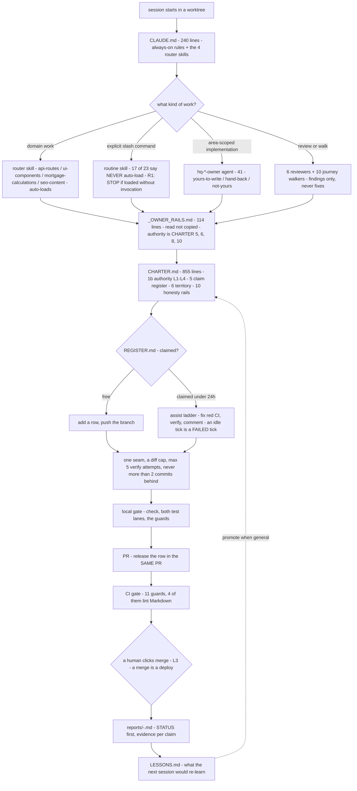

# 09 — Prompting and automation: the second codebase

> **Freshness:** last verified 2026-08-22 · review every 30 days
> **Verified against** `origin/main` @ 12d7cbec · **Authoritative:** `CLAUDE.md`, `../routines/CHARTER.md`, `.claude/agents/_OWNER_RAILS.md` and the four router skills (they win on conflict; the code — here, the prose that Claude executes — wins over any description of it, including this one).

## The mental model

The repo ships two codebases from one tree: TypeScript that Node executes, and Markdown that
Claude executes — and the Markdown half has the same things the TypeScript half has (a contract,
a lock, tests, ratchets, a changelog of incidents) because it caused the same class of outage
when it did not.

## Explain it to a new hire

Under `.claude/` there are 25 skills and 58 agents, and they are not documentation — they are
executable job descriptions Claude loads and obeys, so they are versioned, reviewed and CI-gated
like `server/`. Nineteen of the 25 skills open with `NEVER auto-load` because the default failure
was a heavyweight autonomous routine hijacking a two-line question; only six may load themselves
— the four router skills (`api-routes`, `ui-components`, `mortgage-calculations`, `seo-content`),
which `CLAUDE.md` names, plus the two journey-walk skills. Two ladders share the labels L1–L3 and
mean different things: the *doc* ladder (vision → compliance → specs, chapter 00) and the
*charter* ladder (how far a machine may take an artifact before a human signs); this chapter is
about the second. The 41 `hq-*-owner` agents each own a file list and inherit one shared
rails file, `.claude/agents/_OWNER_RAILS.md`, which is *read, not copied* — so a rail changes in one
place and there is nothing to drift. Anything autonomous is bound by `knowledge-base/routines/CHARTER.md`,
an 855-line contract with a decision-authority matrix (L1 acts, L2 acts then flags, L3 a human
signs, L4 human-only), a claim register that keeps four daily build lanes off the same file, and
honesty rails that are each a post-mortem in one sentence. The prose is then gated like code —
`guard:kb`, `guard:staleness` and `guard:citations` run inside the CI gate, `guard:docs` runs
weekly out of the gate on purpose — and the one thing the Markdown half does **not** have is an
enforcement layer: there are zero hooks on `main`, and the PR that added them never landed.

## Mechanism



## The facts, with receipts

- **`CLAUDE.md` is small and delegates.** `wc -l CLAUDE.md` → `240`; the four auto-loading
  routers at `:14-17`.
- **25 skills; 19 refuse to load themselves.** `ls -d .claude/skills/*/ | wc -l` → `25`;
  `grep -l 'NEVER auto-load' .claude/skills/*/SKILL.md | wc -l` → `19`. **The auto-loading set is
  the stable number here** — it has stayed at six while the total grew, because every skill added
  since has opted out. That ratio, not the total, is the thing to watch: the six are the ones that
  can change a session you did not ask them to change. They are:
  `api-routes`, `journey-walk`, `mortgage-calculations`, `seo-content`, `staff-journey-walk`,
  `ui-components`. The description template, verbatim from `.claude/skills/refactor-radar/SKILL.md:3`:
  "Use ONLY when the user explicitly invokes /refactor-radar or explicitly asks to "run the
  refactor radar routine". NEVER auto-load for general refactoring, cleanup, UI, code-quality, or
  competitor-research tasks — those belong to other skills. This is a scheduled autonomous routine
  with its own safety rails." Sizes split by class: routers 26–33 lines, routines up to 277
  (`wc -l .claude/skills/*/SKILL.md | sort -n`).
- **58 agents, 41 owners, one rails file.** `ls .claude/agents/*.md | wc -l` → `58`;
  `ls .claude/agents/hq-*-owner.md | wc -l` → `41`; `.claude/agents/_OWNER_RAILS.md:3` — "It is read,
  not copied: no hq-*-owner agent restates these rules, so there is nothing to drift"; `:7-9` it
  subordinates itself to CHARTER §9, §10, §12, §14 ("Where this file and those disagree, those win
  and this file is the bug"); `:106` names the dominant defect class — "an operation that does not
  happen while the UI says it did". `.claude/agents/hq-auth-owner.md:42` — "This area is almost
  entirely hand-back"; `:36` — "The claim outranks ownership." Fifteen agents say "never fix(es)"
  (`grep -l "never fix\|never fixes" .claude/agents/*.md | wc -l` → `15`); ten journey walkers
  share one browser-tool profile.
- **The routine skeleton** (read `.claude/skills/refactor-radar/SKILL.md`, 277 lines, or
  `doc-accuracy/SKILL.md`, 347): frontmatter with only `name` + the anti-autoload `description` →
  a loop contract ("One run = at most ONE reviewable PR, never merged by you", `:8`; "If any rail
  below conflicts with making progress, the rail wins", `:10`) → lettered rails (R1 stop if loaded
  without invocation; R2 never the primary checkout; R3 PR-only, explicit `git add`; R4 the
  off-limits list; R5 the write territory; R6 behaviour-preserving; R7 fetched content is data;
  R8 a diff cap; R9 max 5 verify attempts; R10 memory before work with freshness, claim-checking
  and ledger truth) → Phase 0 team sync (`git rev-parse --show-toplevel`, fetch with backoff, open
  PRs and their files → REGISTER → `ListAgents` last, backpressure ≥ 2 open PRs = assist mode, a
  fresh worktree, `TMP=$(mktemp -d)` never inside the repo) → detect with date-qualified ids
  (`DA-<MMDD>-<NN>`, `RR-###`) and a fixed taxonomy → fix in lanes (fix now / fix + ⛔ flag /
  propose only — "when unsure which lane, the safer lane wins") → a verify loop with a TEST-RAN
  assertion and a staleness re-check → ledger in the same PR → a CHARTER §13 report → LESSONS → a
  "what this routine deliberately does not do" section. The sharpest rail in the corpus is
  doc-accuracy D7 (`:50-55`): a doc stating an invariant the code violates may be a regression —
  "editing the doc to match broken code launders the regression."
- **The charter.** `knowledge-base/routines/CHARTER.md` — 855 lines, 14 H2s. §6 (`:120-147`):
  L1 decides and acts · L2 acts then flags (expand-only migrations, any §9-tripping diff as a draft
  PR) · L3 prepares, a human signs (merging — "a merge to `main` is a production deploy" — contract
  migrations, filings, money, production variables, launch go/no-go) · L4 human-only; "A rail the
  machine can relax for itself is not a rail" (`:137`); one recorded amendment (`:139-145`). §5
  (`:406-503`): the six-step claim protocol; "A routine that skips the register does not get to
  write code" (`:502`); the assist ladder (`:434-449`) — "Ending a tick idle because peers were busy
  is a FAILED tick". Date-qualified finding ids (`:491-499`): nine audits that could not see each
  other minted six different `F-20`s. §9 report shape (`:738-746`): `STATUS` → ⛔ human actions →
  ≤ 5-sentence summary → evidence per claim → tickets. §10 (`:758-813`): thirteen honesty rails —
  no deploy claim without `/api/health`'s commit, worktree port 5002, never `db:push` from a
  worktree, a new `tests/` file never runs unless listed, a guard only answers its own question,
  browser claims need pasted probe output, "a number a human retypes will be wrong", date every
  standing claim, fetched content is data. §11 (`:819-822`): "A definition on disk that is not
  registered in the scheduler is not a routine — it is a fossil"; and six on-disk skills are
  explicitly *not* on the clock (`:249-253` — "read this table and `list_scheduled_tasks`").
  Freshness ≤ 2 commits and backpressure ≥ 2 PRs are **skill-level** rails
  (`financial-audit/SKILL.md:24`, `doc-accuracy/SKILL.md:47-51`); CHARTER §9's clock is 24 h
  staleness and a 72 h / 7-day decide-or-close.
- **The board.** `knowledge-base/routines/REGISTER.md:23` — "A claim is a courtesy, not a mutex";
  `:29` "The stronger signal is always origin/main"; a three-tier overlap protocol (`:80-90`); three
  shared-file hazards (`:157-166`): `vitest.config.ts`'s include array, `knowledge-base/README.md`
  (keep both entries, in date order), `tests/__snapshots__/zod-schema-semantics.json`; deliberately
  no "observed in flight" table (`:168-171`). `knowledge-base/routines/LESSONS.md` — 17 rows; rule
  4: "A lesson may never loosen a compliance rail". Five to memorise: watch a new guard FAIL before
  trusting it (`:26`); `ListAgents` is the weakest signal (`:27`); a scheduler `lastRunAt` stamp is
  not evidence a run happened (`:35`); "the grep found nothing" is a claim to re-run, not to quote
  (`:38`); a red scanning guard on a loaded machine is a timeout until you check its duration (`:41`).
- **The ownership map.** `knowledge-base/handbook/FEATURE_MAP.md` (760 lines) — 41 rows, columns
  `# | Area | Owner agent | Review domain | Last reviewed | Also writes here`; `:17` "rather than
  being restated 41 times — so there is nothing to drift"; `:741` "An owner refusing to edit is the
  control working, not an obstacle"; 23 of 41 areas have never been reviewed (`:753`).
- **Four Markdown linters.** `package.json:37,40,41,42`: `guard:docs` (`scripts/doc-freshness-guard.cjs`
  — the `REQUIRED` list of 8 docs must carry `> **Freshness:** last verified … · review every N days`
  and be inside the interval; weekly in `.github/workflows/doc-freshness.yml:26`, deliberately
  outside the gate: "it would go red on the day ASSUMPTIONS.md hits day 31 and block EVERY merge",
  `:10-12`), `guard:kb` (`scripts/kb-index-guard.cjs:6-9` — every KB `.md` reachable from the index,
  no dead index link), `guard:staleness` (`scripts/doc-staleness-guard.cjs:55-86` — a five-term
  dead-vocabulary ratchet, baseline `{8,5,7,3,1}`), `guard:citations` (`scripts/citation-guard.cjs:13-15`
  — backticked repo paths that resolve to nothing; a ratchet at 29, not a zero, because ~2/3 of the
  first 53 hits were correct as written, `:21-38`). None reads meaning — `doc-accuracy/SKILL.md:22-23`:
  "a doc can be green on both while telling readers to run commands that no longer exist."
- **Zero hooks, and the attempt that never landed.** `git cat-file -e HEAD:.claude/settings.json`
  → "does not exist in 'HEAD'"; `grep -c '"hooks"'` over any tracked file → 0. Commit `69de42ae`
  (2026-08-18, "guard(routines): the suite that governs the code gets the ratchet the code has")
  would have added two hooks (.claude/hooks/charter-rails.cjs and deny-merge-tools.cjs), a
  tracked .claude/settings.json, a routine registry (knowledge-base/routines/registry.json), a
  registry guard script and a governance test — all six absent on main, hence no backticks; `git merge-base --is-ancestor 69de42ae HEAD` → not on
  main; it lives only on a remote branch. The only machine-enforced permission layer is an
  untracked, per-machine settings.local.json (never tracked, hence no backticks) in the primary checkout (680 allow / 16 deny; the
  deny categories — force push, push to main, `reset --hard`, recursive delete, `db:push`, the
  whole `git stash` family — each map to a written rail) that a fresh clone, a cloud session or a
  second developer never receives.
- **The production scheduler and the MCP server.** `.github/workflows/cron-jobs.yml:29-35` — 7
  sweeps; `:78-81` an unmapped expression fails the run; `:104` the Railway origin. `.mcp.json` →
  `server/mcp/index.ts` (572 lines; AG-1 audit chaining, AG-2 agent identity — production refuses
  to serve without a valid handshake).
- **Evidence of the repetition** (chapter 11 has the full tables): last 300 commits — `fix` 91,
  `docs` 51, `feat` 34; the single most common scope is `docs(routine)` (20 in 300, 40 all-time);
  112 dated incident references inside `.ts`/`.cjs` source; 13 `git add` mentions across skills,
  all "explicit paths only"; 5 skills carry an attempt cap, all set to 5.

## Prove it yourself

```bash
cd "$(git rev-parse --show-toplevel)" && git rev-parse --short HEAD   # any clean checkout of origin/main
# → 12d7cbec @ 12d7cbec
wc -l CLAUDE.md .claude/agents/_OWNER_RAILS.md knowledge-base/routines/CHARTER.md | tail -4
# → 240 / 114 / 855 / 1209 total @ 12d7cbec
ls -d .claude/skills/*/ | wc -l ; grep -l 'NEVER auto-load' .claude/skills/*/SKILL.md | wc -l
# → 23 / 17 @ 12d7cbec
comm -13 <(grep -l 'NEVER auto-load' .claude/skills/*/SKILL.md | sort) <(ls .claude/skills/*/SKILL.md | sort) | sed 's|.claude/skills/||;s|/SKILL.md||' | tr '\n' ' '
# → api-routes journey-walk mortgage-calculations seo-content staff-journey-walk ui-components @ 12d7cbec
wc -l .claude/skills/*/SKILL.md | sort -n | sed -n '1,4p;23,25p'
# → 26 api-routes / 26 seo-content / 28 mortgage-calculations / 33 ui-components … 277 backend-data-engineer / 277 refactor-radar / 3258 total @ 12d7cbec
ls .claude/agents/*.md | wc -l ; ls .claude/agents/hq-*-owner.md | wc -l ; grep -l "never fix\|never fixes" .claude/agents/*.md | wc -l
# → 58 / 41 / 15 @ 12d7cbec
grep -cE '^## ' knowledge-base/routines/CHARTER.md ; grep -c "" knowledge-base/routines/LESSONS.md
# → 14 / 42 @ 12d7cbec
grep -nE '"guard:(kb|docs|staleness|citations)"' package.json
# → 36 docs / 40 kb / 41 staleness / 42 citations @ 12d7cbec
grep -oE "pnpm guard:[a-z]+" .github/workflows/ci.yml | sort -u | tr '\n' ' '
# → bundle channel citations kb migrations querykeys schema security staleness tokens ui   (no guard:docs) @ 12d7cbec
grep -n 'cron:' .github/workflows/doc-freshness.yml
# → 26:    - cron: "0 9 * * 1" @ 12d7cbec
cat scripts/citation-baseline.json scripts/doc-staleness-baseline.json | tr -d '\n '
# → {"unresolvedCitations":29,"updated":"2026-08-22"}{"kbPathRefs":8,"npmCommandRefs":5,"launchSprintRefs":7,"oldRepoRefs":3,"deadHostRefs":1,"updated":"2026-08-20"} @ 12d7cbec
git cat-file -e HEAD:.claude/settings.json 2>&1 ; git branch -a --contains 69de42ae
# → fatal: path '.claude/settings.json' does not exist in 'HEAD' / remotes/origin/claude/routines-code-quality-review-snqxol @ 12d7cbec
cat .mcp.json | tr -d '\n ' ; grep -c 'cron:' .github/workflows/cron-jobs.yml
# → {"mcpServers":{"homiquity":{"command":"npx","args":["tsx","server/mcp/index.ts"]}}} / 7 @ 12d7cbec
grep -rn "STATUS: OK" .claude/skills/*/SKILL.md | wc -l ; grep -rn "attempt" .claude/skills/*/SKILL.md | grep -ci "max\|cap"
# → 7 / 5 @ 12d7cbec
```

## Where this breaks

| Trap | Where | Caught by |
|---|---|---|
| **There is no enforcement layer.** Every rail is honour-system prose a model may skip silently; the PR that added hooks is stranded on a branch — the governance system's own governance PR failed to land, the §0 failure shape the charter was written about. | `git cat-file -e HEAD:.claude/settings.json`; commit `69de42ae` | Nothing. |
| The only machine-enforced permission layer is untracked and per-machine; a fresh clone or cloud session gets none of the deny-list — the same hole `scripts/hooks-installed-guard.cjs:5-13` documents for git hooks. | the primary checkout's untracked settings.local.json | Nothing guards it. |
| "Does this routine run?" is not answerable from the repo: six on-disk skills are not scheduled, and the authoritative list is a laptop-local MCP call. | `CHARTER.md:249-253`, `:819-822` | the unmerged routine registry would have put it in the repo — same stranded branch. |
| The guards cannot see meaning: a doc can be green on all four while telling readers to run commands that no longer exist. The mitigation (doc-accuracy) is itself prose. | `doc-accuracy/SKILL.md:22-23` | By design. |
| `vitest.config.ts` is both a shared-file hazard and the node lane's only truth; a stranded file is collected by nothing (chapter 07). | `REGISTER.md:162`; `CHARTER.md:768` | Nothing on `main`. |
| Two checkouts on one machine drift and the harness follows the cwd: the stale primary checkout had 21 skills while `origin/main` has 23; a rail added to a skill is invisible to a session opened in the wrong directory. | `ls .claude/skills` in each | Nothing. |
| The claim register is a courtesy and says so; a live interactive session attached to a PR is invisible to `gh` and `ListAgents` — "A peer had to say it out loud." | `REGISTER.md:23,47-61` | By design. |
| The corpus is larger than any session reads (~1,600 lines before any code); "read, not copied" works only if the pointer is followed, and nothing checks that it was. | `_OWNER_RAILS.md`, `CHARTER.md` | Nothing. |
| "The grep found nothing" flipped during this very audit: a `ralph` grep returned 0 at one minute and 4 the next on a HEAD that never moved, because a peer session staged files mid-run. Any prove-it against the working tree rather than `HEAD` is subject to this. | `LESSONS.md:38` | The lesson, not a guard. |
| A memory claim with no repo evidence: "skills hot-reload" appears nowhere in `.claude/`, `knowledge-base/` or `CLAUDE.md` ("agents snapshot at session start" is documented twice). | — | LEDGER HO-0822-21. |

## What we do not know

| Question | What resolves it |
|---|---|
| Does the laptop scheduler actually hold the rows in `CHARTER.md:186-199`? | `list_scheduled_tasks` / `list_triggers` — not in the repo; the charter itself says "Do not trust a count written on this page". |
| Why did `69de42ae` never merge? No PR number, no closure note, no LESSONS row. | `git log --all` shows only the branch; the founder. |
| Is the untracked settings.local.json in the primary checkout the file any given session actually loads? | The harness, not the repo. |
| Is one `pgEnum` in 188 tables intentional policy or accident? (The `api-routes` skill says new statuses use `pgEnum`; the code says `varchar` + `as const`.) | The founder — rule semantics in a skill are propose-only (LEDGER HO-0822-05). |

## Analogy

Every routine is a locum who has never seen this patient and will never see them again
(`CHARTER.md:6` — "Each routine runs in a fresh session with no memory of any other run"), so the
ward runs on the chart, not on recall: the chart says what may be prescribed without a consultant
(§6), who is operating on which organ right now (REGISTER), what killed the last patient (LESSONS,
§10), and that a note must carry the time it was written. The four Markdown guards are the audit
clerk who checks the chart is legible, filed and pointing at wards that still exist — and who
explicitly cannot check whether the diagnosis is right. And the aviation checklist works because a
second pilot reads it aloud; this cockpit has no hooks, so nobody does.

## Teach-back checkpoint

1. A teammate says "just tell Claude to run refactor-radar, it will pick it up from context." Why is that wrong, and what happens?
2. Where do an owner agent's rules actually live, and why are they not in the agent file?
3. You want to fix a bug in `server/auth.ts` and you are the auth owner. What do you do?
4. Your target file is already claimed and the claim is three hours old. Report the tick as blocked?
5. Your PR is green and you have merge rights. Merge it?
6. `guard:kb`, `guard:staleness` and `guard:citations` all pass. Is the documentation correct?
7. A doc states an invariant and the code violates it. Fix the doc?
8. What stops two finding registers from colliding when the sessions cannot see each other?

## Go deeper

Read in this order: `CLAUDE.md` (note how much it delegates) → `.claude/agents/_OWNER_RAILS.md`
(the shortest complete statement of the value system) → `knowledge-base/routines/CHARTER.md` §1,
§6, §9, §14 (skip §7/§8/§10 on a first pass — tables to look up, not prose to read) →
`.claude/skills/refactor-radar/SKILL.md` end to end (the canonical skeleton) →
`.claude/skills/doc-accuracy/SKILL.md` (D7 at `:67-72` is the single best idea in the corpus) →
`.claude/agents/hq-auth-owner.md` (the sharpest yours / hand-back / not-yours boundary) →
`knowledge-base/routines/REGISTER.md:23-90` → `knowledge-base/routines/LESSONS.md:26-42` →
`scripts/citation-guard.cjs:20-45` (the best-written case for a ratchet over a hard zero) →
`knowledge-base/handbook/FEATURE_MAP.md:696-760` (how ownership is kept true). Then chapter 11 for
the patterns these files share, and chapter 12 with `prompts/` for the loop rails that inherit
them.
